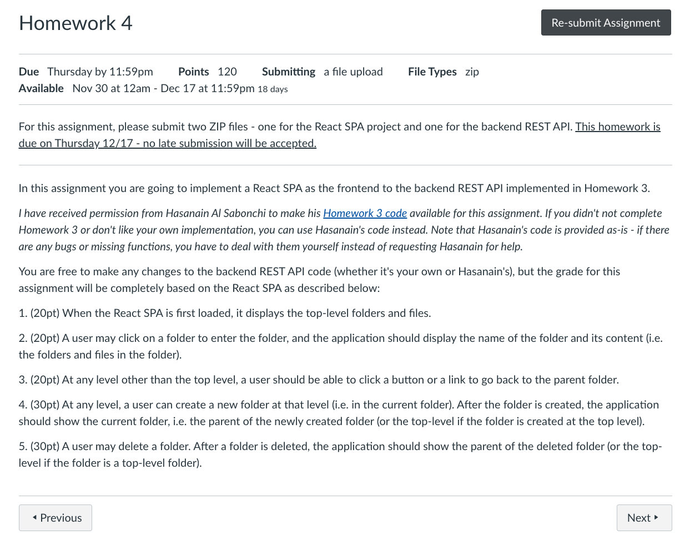

# React

`To create a  react app called my-app, run this command:`

<pre> npx create-react-app my-app
  cd my-app
  npm start </pre>
  
  ## Hooks
  ### useEffect
  - By default, it runs both after the first render and after every update.
  - Placing useEffect inside the component lets us access the count state variable (or any props) right from the effect.
  
  
  
  

   
   
   
   
   
   
   
   
   
   
   
   ---
  
  ### Resources:
  - [State Management in React](https://www.youtube.com/watch?v=tYJqGc0TD1g).
  - [React for Building Single Page Applications (SPA)](https://www.youtube.com/watch?v=9_IHKj7npbA).
  - [React for Building UI Components](https://www.youtube.com/watch?v=Jl-z2ZgCdvI).
