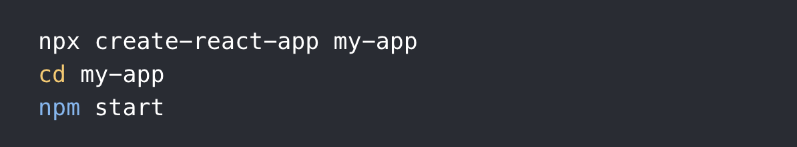

### React
## Create React App
- You’ll need to have Node >= 8.10 and npm >= 5.6 on your machine.  
To create a project, run.   
`npx create-react-app my-app
cd my-app
npm start`

---
Component

App.js is a component. file that holds all the logic in one file.

1- create React from React. 
2- create function. 
